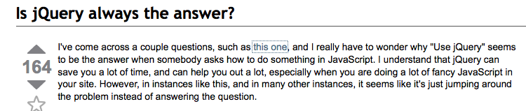
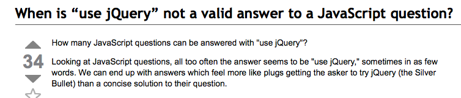
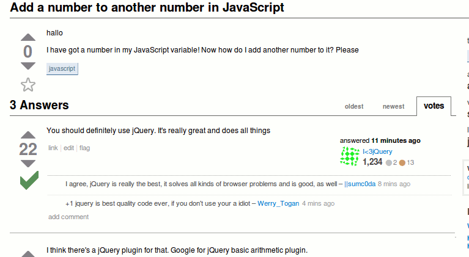

!SLIDE 

# Grails 1.x #

	@@@ xml

	<g:javascript library="prototype" />

!SLIDE

# Grails 2.0 #

	@@@ xml

	<g:javascript library="jquery" />

!SLIDE 

# some things you may have heard about jQuery... #

!SLIDE center

!SLIDE center

!SLIDE center

!SLIDE

# But seriously... #

 jQuery solves many of the traditional problems involved in developing JavaScript intensive web applications

!SLIDE

# jQuery facts #

!SLIDE

 * Most popular JavaScript libary in use today
 * Used in 46% of top 10,000 websites
 * Embedded in many platforms (.NET, Grails, etc.)

!SLIDE

# Selectors #

	@@@ javascript
		
		$('#myDiv') // id selector
		$('.myClass')  // class selctor
		$('div')  // type selector 

!SLIDE

# Selectors #

	@@@ javascript
		
		$(':input') // special selectors
		$('#main > div')  // child selctor
		$('#main form')  // descendant selector 

!SLIDE

# DOM Manipulation #

	@@@ javascript

		$('myDiv').addClass('myClass')
		$('myDiv').removeClass('myClass')

!SLIDE

# DOM Manipulation #

	@@@ javascript
		
		$('myDiv').show()
		$('myDiv').hide()

!SLIDE

# Event handling #

	@@@ javascript

		$(':button').click(function() {
			this.attr('disabled', 'disabled');
		});
		

